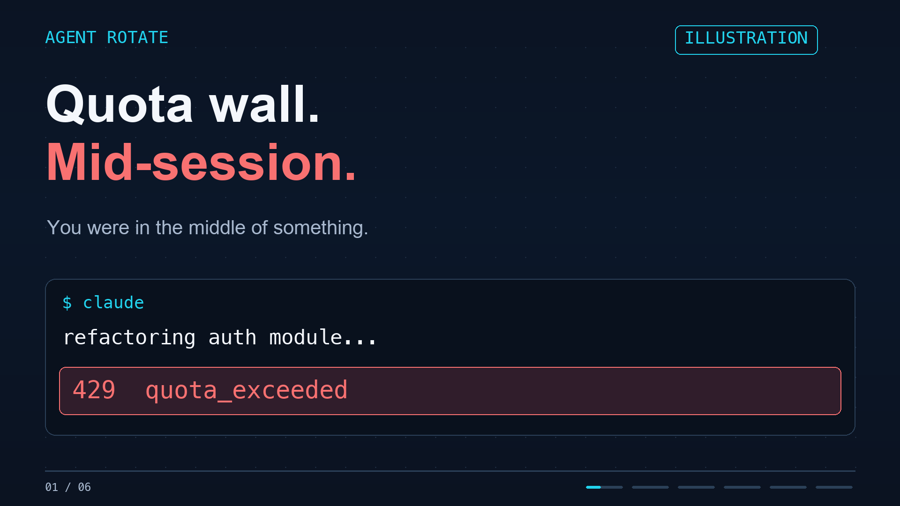

# Agent Rotate — X post and feature video

A 25-second overview for developers using native Claude Code and Codex. Copy and art direction by Claude Fable 5.1; local rendering by Codex. These are drafts for DFM to share. Nothing has been posted to X.

[](agent-rotate-promo.mp4)

- [Download the MP4](agent-rotate-promo.mp4): 1920×1080, 30 fps, H.264, 25 seconds, silent.
- [Primary X post](x-post.txt): 272 weighted characters. Attach the MP4 to this post.
- [Alternate X post](x-post-alternate.txt): 275 weighted characters.
- [Poster](poster.png) · [Closing card](end-card.png) · [Scene contact sheet](contact-sheet.png).
- [Fable's original storyboard](fable-storyboard.json) · [Public-repo copy revision](fable-public-revision.json) · [Production notes](fable-provenance.md) · [File validation](validation.json).

The CTA links directly to **[github.com/davefmurray/agent-rotate](https://github.com/davefmurray/agent-rotate)**. GitHub reported the repository public during final verification on 2026-09-11. Fable revised the original access-request CTA accordingly. X counts the repository URL as 23 characters.

## Story

| Time | Scene |
| --- | --- |
| 0–2.5s | A quota rejection interrupts a coding task. |
| 2.5–6.5s | Agent Rotate: local routing for Claude Code and Codex. |
| 6.5–13s | Illustrated failover to another account of the same provider before response delivery. |
| 13–18.5s | The actual quota dashboard renderer, using sample data. |
| 18.5–22s | Pools, optional thresholds, saved resume, read-only MCP, and native controls. |
| 22–25s | Get started on GitHub, with the public repository URL. |

The video is an animated feature overview, not a recording of live quota exhaustion. Terminal and routing diagrams carry **ILLUSTRATION** labels. The dashboard carries **SAMPLE DATA** throughout and uses a crop of [the existing renderer export](../assets/README.md). Account names and usage values are synthetic.

Routing requires wrapper-launched sessions and an eligible fallback account of the same provider. It cannot replay a partially delivered response. See the [compatibility limits](../../README.md#compatibility-and-limits) and [verification evidence](../verification.md). Injected 429 tests with real fallback inference have passed for both providers; natural quota exhaustion remains unverified.

## Regenerate

From the repository root on macOS:

```sh
uv run --with pillow --with imageio-ffmpeg python docs/launch/render_video.py

# Preview the stills without encoding the video:
uv run --with pillow --with imageio-ffmpeg python docs/launch/render_video.py --stills-only
```

The renderer reads only the checked-in sample dashboard and local Arial/Menlo fonts. It uses Pillow and imageio-ffmpeg's bundled encoder, writes only this directory, and makes no provider requests. These packages are documentation tooling, not application dependencies. The video has no soundtrack and is designed to work with sound off.

The script also writes one PNG per scene for review. After changing the video, refresh `validation.json` and review the encoded frames before sharing; its SHA-256 identifies the reviewed MP4.
